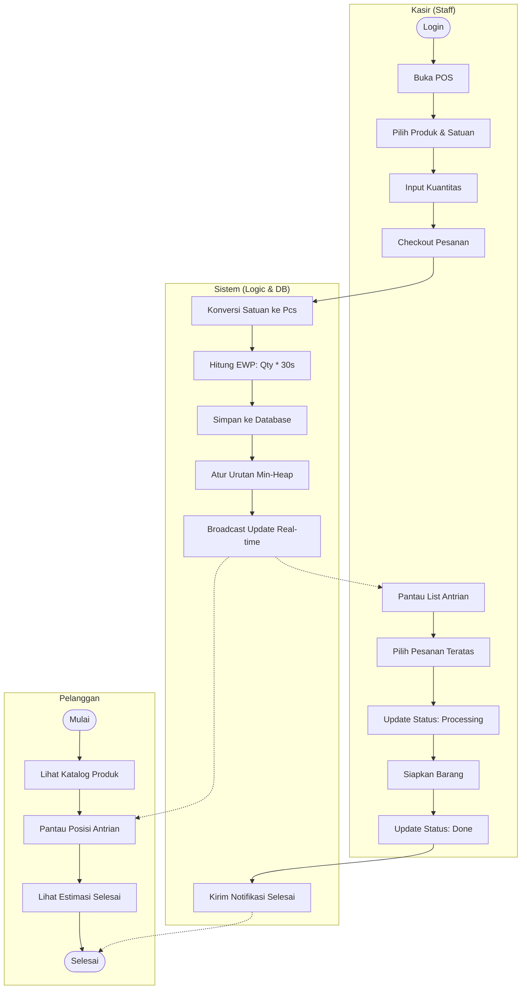
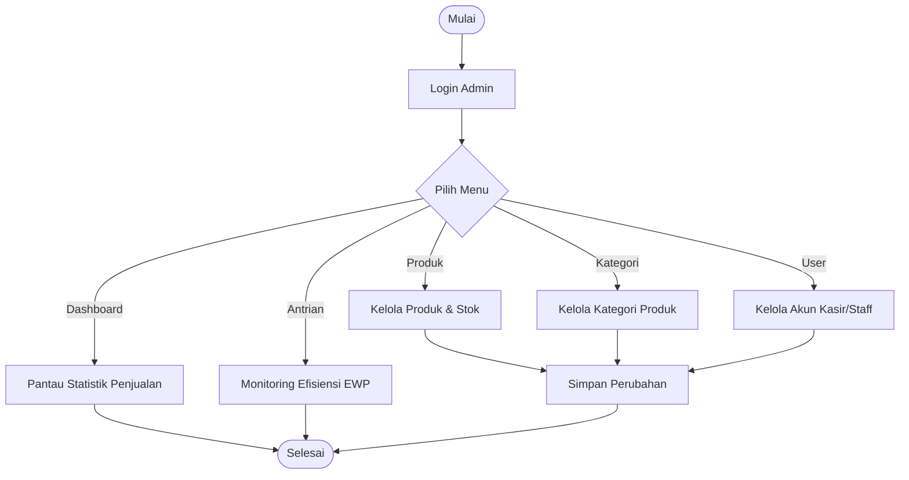

# Activity Diagram - Sistem POS Grosir Priority Queue

Dokumen ini berisi rancangan Activity Diagram untuk sistem POS Grosir yang menggunakan algoritma **Priority Queue (Min-Heap)** dengan metrik **Shortest Job First (SJF)**.

## 1. Alur Utama Transaksi dan Antrian

Diagram ini menjelaskan alur kerja dari input pesanan oleh Kasir hingga penyelesaian pesanan dan pelacakan oleh Pelanggan.

## 2. Alur Manajemen Admin

Diagram ini menjelaskan aktivitas administratif yang dilakukan oleh Pemilik atau Manajer Toko.

## Deskripsi Aktivitas

### A. Alur Pemesanan (Kasir & Sistem)
1.  **Input Pesanan**: Kasir memilih produk dan satuan (misal: Dus, Slop, Pack).
2.  **Kalkulasi EWP**: Sistem secara otomatis mengonversi satuan ke unit terkecil (Pcs) dan menghitung *Estimated Work Period* (EWP). Rumus: `EWP = Total Pcs × 30 Detik`.
3.  **Antrian Priority**: Pesanan dimasukkan ke dalam antrian **Min-Heap**. Pesanan dengan EWP terkecil (beban kerja paling ringan) akan berada di urutan teratas. Jika EWP sama, pesanan yang masuk lebih awal (Timestamp) didahulukan.
4.  **Real-time Update**: Sistem memperbarui tampilan antrian di sisi Kasir dan Pelanggan secara instan menggunakan Supabase Realtime.

### B. Pemrosesan Antrian (Kasir)
1.  **Monitoring**: Kasir melihat daftar pesanan yang harus dikerjakan berdasarkan prioritas.
2.  **Processing**: Kasir mengubah status menjadi "Processing" saat mulai menyiapkan barang.
3.  **Completion**: Setelah barang siap, status diubah menjadi "Done". Sistem akan melakukan *Extract Min* pada heap dan memberikan notifikasi kepada pelanggan.

### C. Pelacakan Pelanggan
1.  **Queue Tracking**: Pelanggan dapat melihat posisi antrian mereka tanpa harus login (atau via akun).
2.  **Estimasi**: Pelanggan mendapatkan transparansi mengenai berapa lama lagi pesanan mereka akan diproses berdasarkan akumulasi EWP pesanan di atasnya.

### D. Manajemen (Admin)
1.  **Inventory Control**: Admin bertanggung jawab atas ketersediaan stok dan pengaturan konversi satuan.
2.  **User Management**: Mengelola hak akses untuk staff kasir.
3.  **Analytics**: Menganalisis apakah estimasi waktu (EWP) sesuai dengan realita pengerjaan di lapangan untuk optimasi layanan.
